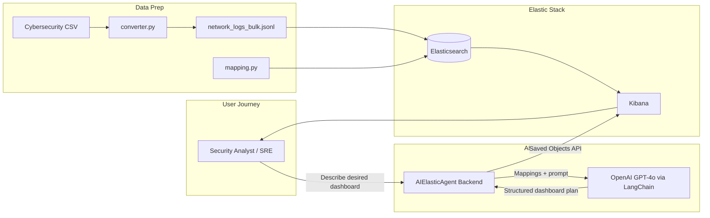

# AIElasticAgent – AI-Assisted Kibana Dashboards for Security Teams

AIElasticAgent turns natural-language monitoring goals into ready-to-use Kibana dashboards, stitching together the Elastic Stack, OpenAI models (via LangChain), and lightweight ingestion utilities. The project is inspired by and extends the ideas shared in [Elastic's AI-powered dashboards](https://www.elastic.co/search-labs/blog/ai-powered-dashboards) exploration, showing how far you can take automated dashboard generation with a production-grade toolchain.

---

## Why it stands out
- **Transforms analyst intent into assets.** Feed it a plain-English description and it provisions the visualizations, panel layouts, and saved objects you need inside Kibana automatically.
- **Speaks Elasticsearch natively.** Index mappings are validated before a dashboard is built, so every visualization references real fields and stays resilient to schema drift.
- **Full-stack glue.** Converter scripts, mapping helpers, Dockerized services, and environment management show how to operationalize AI features end-to-end—not just call an API.
---

## System architecture


---

## Feature highlights
| Capability | What it delivers |
|------------|------------------|
| **Natural-language dashboard authoring** | Structured prompts and Pydantic validation coerce the LLM into returning consistent dashboard specs that Kibana can ingest immediately.
| **API-first automation** | Uses the Kibana Saved Objects API to stand up visualizations and dashboards without manual clicks, enabling CI/CD for observability assets.
| **Schema-aware ingestion** | Utilities for shaping CSV cybersecurity data into Elasticsearch-friendly mappings and bulk JSONL keep the stack aligned with production telemetry.
| **Containerized stack** | `docker-compose` spins up Elasticsearch, Kibana, Ollama, a backend service, and a static UI shell so you can demo the workflow in minutes.

---

## Quick start
1. **Clone & enter the repo**
   ```bash
   git clone https://github.com/<your-org>/AIElasticAgent.git
   cd AIElasticAgent
   ```

2. **Provision environment variables** – create a `.env` file at the repo root with at least:
   ```env
   OPENAI_API_KEY=sk-...
   KIBANA_URL=http://localhost:5601
   ELASTICSEARCH_URL=http://localhost:9200
   ```
   Swap in organization-specific OpenAI endpoints or models as needed.

3. **Prepare sample data (optional, but recommended for demos)**
   ```bash
   python converter.py                     # builds network_logs_bulk.jsonl
   python backend/mapping.py               # creates the `network-logs` index with explicit mapping
   curl -s -H 'Content-Type: application/json' \
     -XPOST 'http://localhost:9200/_bulk?pretty' \
     --data-binary @network_logs_bulk.jsonl
   ```

4. **Start the stack**
   ```bash
   docker-compose up --build
   ```
   - Backend API placeholder: `http://localhost:8000`
   - Static front-end shell (replace with your UI): `http://localhost:8080`
   - Elasticsearch Dev Tools: `http://localhost:9200`
   - Kibana dashboards: `http://localhost:5601`
   - Ollama LLM runtime: `http://localhost:11434`

5. **Generate a dashboard**
   Call the `main` entry point from `backend/kibana_agent.py` (or integrate into your FastAPI app) with an English description and the index mappings you created.
   ```python
   from backend.kibana_agent import main
   from backend.kibana_agent import Dashboard

   description = "Show me top attack types by severity with trend lines over time."
   index_mappings = """{ \"properties\": { \"Severity\": {\"type\": \"keyword\"}, \"timestamp\": {\"type\": \"date\"} } }"""
   templates = {}

   result = main(description, index_mappings, templates)
   print(result)
   ```
   You’ll receive the created dashboard URL and IDs for any downstream automation.

---

## How it maps to the Elastic AI dashboards article
| Article insight | Project implementation |
|-----------------|------------------------|
| *Blend LLM reasoning with observability context.* | Prompt engineering keeps the model grounded in your Elasticsearch mappings and uses structured outputs so the responses line up with Kibana’s saved object schema. |
| *Automate dashboard provisioning.* | The backend posts visualizations and dashboards through Kibana’s REST API, recreating the hands-off experience described in the Elastic Search Labs project. |
| *Start from your own data.* | CSV → JSONL converters and mapping helpers let you onboard proprietary telemetry before invoking the LLM, mirroring the article’s emphasis on customer-specific datasets. |

---

## Customize & extend
- **Swap the LLM** – Point `init_chat_model` to your enterprise endpoint (OpenAI, Azure OpenAI, self-hosted Ollama) or extend the LangChain chain with retrieval augmentations.
- **Enrich visualizations** – Expand the visualization template logic to support Lens, TSVB, or custom Vega panels, or fan out multiple aggregation strategies per field.
- **Productionize the backend** – Wrap `main` with FastAPI routes, add auth, and wire in async task queues for large dashboard batches.
- **Integrate CI/CD** – Because everything runs through APIs, you can check dashboard definitions into Git, replay them in staging, or pair with Terraform for repeatable observability environments.

If you’re evaluating talent for AI platform roles, SRE/observability modernization, or security analytics, this repository demonstrates the ability to ship real, end-to-end solutions.
